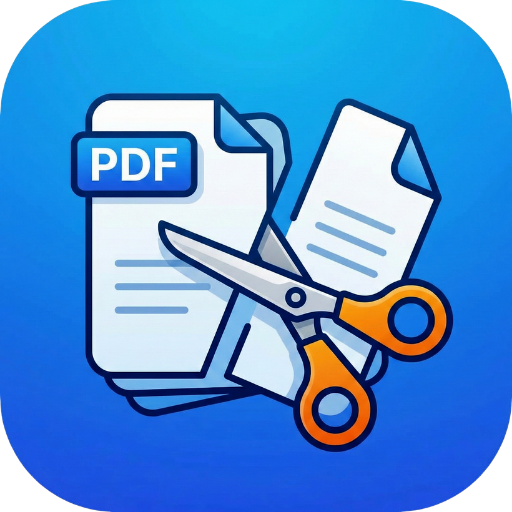

  

<h1 align="center">PDF Toolkit - All-in-One PDF Master 📄🛠️</h1>

  <strong>Experience the ultimate PDF productivity suite. From scanning paper documents to merging, splitting, and signing—PDF Toolkit handles every task with seamless, lightning-fast performance.</strong>

  

---

## 🌍 Your Pocket PDF Powerhouse
Unlock professional-grade PDF tools on your phone. Whether you need to digitize receipts, combine reports, protect confidential documents, or sign contracts on the go, PDF Toolkit is the only app you'll ever need. Built for efficiency, security, and ease of use.

## ✨ Key Features & Specifications
Designed with a sleek, premium, and modern Flutter interface, PDF Toolkit is engineered to provide the best document handling experience.

- **Smart Document Scanner 📸**: High-quality multi-page scanning with edge detection and image enhancement.
- **Merge & Split PDF 🔗**: Combine multiple files into one or extract specific pages with ease.
- **Image to PDF & Back 🖼️**: Convert JPG, PNG, and more to PDFs, or extract high-res images from any PDF.
- **Sign & Fill PDFs ✍️**: Add digital signatures using your finger, upload a saved signature, or use premium presets.
- **Secure & Unlock 🔒**: Add robust password protection to your files or remove restrictions from protected PDFs.
- **Compress & Optimize 📉**: Reduce file sizes for easy sharing without sacrificing document quality.
- **Watermark & Annotate 🏷️**: Protect your work with custom text or image watermarks.
- **Page Management 🔄**: Rotate, rearrange, or add page numbers to your documents effortlessly.
- **Text Extraction (OCR) 🔍**: Convert PDF pages into editable text with intelligent processing.
- **Built-in File Manager 📂**: Organize your documents, view history, and access favorites instantly.
- **Dark & Light Themes 🌗**: Premium design with native dark mode support to reduce eye strain.

## 🚀 Why Choose PDF Toolkit?
**Q: What is the best free PDF utility app for Android?**
A: PDF Toolkit stands out by offering a comprehensive, all-in-one suite of over 20+ PDF tools. Most apps charge for features like signing or watermarking, but we provide a premium, near-ad-free experience for everyone.

**Q: Can I sign documents securely on my phone?**
A: Absolutely! Our "Sign PDF" feature allows you to draw your signature or upload an image, ensuring you can finalize contracts and forms in seconds.

**Q: Is it safe to use for sensitive documents?**
A: Yes. All processing is done locally on your device, and our "Protect PDF" feature allows you to add military-grade encryption to your files.

## 📥 Download Now
Don't settle for basic PDF readers. Download the APK directly or get it from the Google Play Store to unlock the full potential of your documents!
**[Download the APK directly from the Google Play Store via this link!](https://play.google.com/store/apps/details?id=com.thealgrow.pdftoolkit)**

  

---
*If you love the app, please leave a 5-star review on the Play Store! For support, use the in-app "Report Issue" or "Contact Us" screens.*
